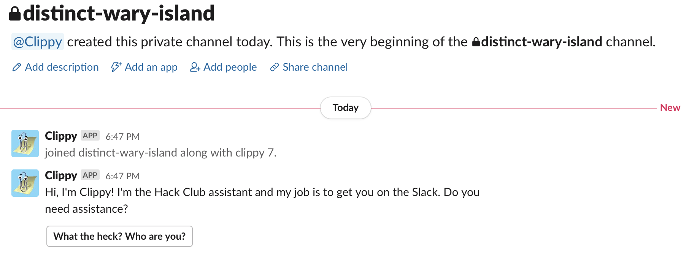

Clippy is now living a nice retirement, still hanging out in Slack but not having to work. Check out the [Toriel repository](https://github.com/hackclub/toriel) to see the code for Hack Club's current greeting bot.

--------

Clippy is a friendly bot that welcomes new members to the Hack Club Slack with a 1-minute interactive introduction to the community.

If you're already a member of the Slack but are interested in going through the new onboarding flow, you can still do so by typing `/restart` anywhere in the Hack Club Slack. Feedback is highly appreciated!

To get started, send a message mentioning `@creds` in [Hack Club's Slack](https://hackclub.com/slack/) asking for:
- The `.env` file
- To be added to the `clippy (dev)` app on Slack.
